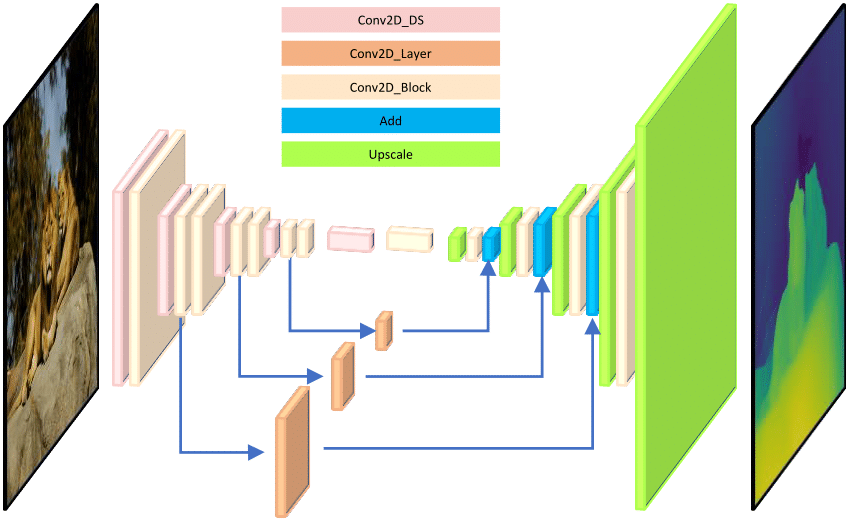

#### FPGA Implementation of Monocular Depth Estimation Model: MiDaSNet

This repository contains code to FPGA implementation of depth estimation model, MiDaSNet.

The figure below shows the architecture of fully convolutional MiDaSNet_small model.
<p align="center">
  
</p>


### Usage

1) To quantize the float model you may use the docker image which is generated from a recipe provided by Xilinx:

    ```shell
    docker pull yasinadiyaman/xilinx-vitis-ai-pytorch-gpu
    ```

2) Run the docker image. Then, inside docker, run the bash script:

    ```shell
    bash quantize.sh
    ```

3) After xmodel file generated, copy xmodel file with meta.json into Kria KV260 board (tested on Ubuntu image, not on Petalinux).

4) Check the required files for run. I could not upload big files into the repo. You should download them from provided links.

5) Evaluate the model on NYUv2. You may use another dataset, just copy images and ground truth depth maps under data/ directory.
   
    ```shell
    python evaluate_xmodel.py
    ```
    
6) To compare inferenced depth maps from CPU and DPU on sample results:  

   ```shell
   python visualize.py
   ```
   
#### optional

For the Next-ViT model, execute

```shell
git submodule add https://github.com/isl-org/Next-ViT midas/external/next_vit
```

For the OpenVINO model, install

```shell
pip install openvino
```
    
### Usage

1) Place one or more input images in the folder `input`.

2) Run the model with

   ```shell
   python run.py --model_type <model_type> --input_path input --output_path output
   ```
   where ```<model_type>``` is chosen from [dpt_beit_large_512](#model_type), [dpt_beit_large_384](#model_type),
   [dpt_beit_base_384](#model_type), [dpt_swin2_large_384](#model_type), [dpt_swin2_base_384](#model_type),
   [dpt_swin2_tiny_256](#model_type), [dpt_swin_large_384](#model_type), [dpt_next_vit_large_384](#model_type),
   [dpt_levit_224](#model_type), [dpt_large_384](#model_type), [dpt_hybrid_384](#model_type),
   [midas_v21_384](#model_type), [midas_v21_small_256](#model_type), [openvino_midas_v21_small_256](#model_type).
 
3) The resulting depth maps are written to the `output` folder.

#### optional

1) By default, the inference resizes the height of input images to the size of a model to fit into the encoder. This
   size is given by the numbers in the model names of the [accuracy table](#accuracy). Some models do not only support a single
   inference height but a range of different heights. Feel free to explore different heights by appending the extra 
   command line argument `--height`. Unsupported height values will throw an error. Note that using this argument may
   decrease the model accuracy.
2) By default, the inference keeps the aspect ratio of input images when feeding them into the encoder if this is
   supported by a model (all models except for Swin, Swin2, LeViT). In order to resize to a square resolution,
   disregarding the aspect ratio while preserving the height, use the command line argument `--square`. 

#### via Camera

   If you want the input images to be grabbed from the camera and shown in a window, leave the input and output paths
   away and choose a model type as shown above:

   ```shell
   python run.py --model_type <model_type> --side
   ```

   The argument `--side` is optional and causes both the input RGB image and the output depth map to be shown 
   side-by-side for comparison.

#### via Docker

1) Make sure you have installed Docker and the
   [NVIDIA Docker runtime](https://github.com/NVIDIA/nvidia-docker/wiki/Installation-\(Native-GPU-Support\)).

2) Build the Docker image:

    ```shell
    docker build -t midas .
    ```

3) Run inference:

    ```shell
    docker run --rm --gpus all -v $PWD/input:/opt/MiDaS/input -v $PWD/output:/opt/MiDaS/output -v $PWD/weights:/opt/MiDaS/weights midas
    ```

   This command passes through all of your NVIDIA GPUs to the container, mounts the
   `input` and `output` directories and then runs the inference.

#### via PyTorch Hub

The pretrained model is also available on [PyTorch Hub](https://pytorch.org/hub/intelisl_midas_v2/)

#### via TensorFlow or ONNX

See [README](https://github.com/isl-org/MiDaS/tree/master/tf) in the `tf` subdirectory.

Currently only supports MiDaS v2.1. 


#### via Mobile (iOS / Android)

See [README](https://github.com/isl-org/MiDaS/tree/master/mobile) in the `mobile` subdirectory.

#### via ROS1 (Robot Operating System)

See [README](https://github.com/isl-org/MiDaS/tree/master/ros) in the `ros` subdirectory.

Currently only supports MiDaS v2.1. DPT-based models to be added. 


### Accuracy


### Depth map comparison

Zoom in for better visibility


### Speed on Camera Feed	

Test configuration	
- Windows 10	
- 11th Gen Intel Core i7-1185G7 3.00GHz	
- 16GB RAM	
- Camera resolution 640x480	
- openvino_midas_v21_small_256	

Speed: 22 FPS


### Citation

Please cite our paper if you use this code or any of the models:
```
@ARTICLE {Ranftl2022,
    author  = "Ren\'{e} Ranftl and Katrin Lasinger and David Hafner and Konrad Schindler and Vladlen Koltun",
    title   = "Towards Robust Monocular Depth Estimation: Mixing Datasets for Zero-Shot Cross-Dataset Transfer",
    journal = "IEEE Transactions on Pattern Analysis and Machine Intelligence",
    year    = "2022",
    volume  = "44",
    number  = "3"
}
```

If you use a DPT-based model, please also cite:

```
@article{Ranftl2021,
	author    = {Ren\'{e} Ranftl and Alexey Bochkovskiy and Vladlen Koltun},
	title     = {Vision Transformers for Dense Prediction},
	journal   = {ICCV},
	year      = {2021},
}
```

Please cite the technical report for MiDaS 3.1 models:

```
@article{birkl2023midas,
      title={MiDaS v3.1 -- A Model Zoo for Robust Monocular Relative Depth Estimation},
      author={Reiner Birkl and Diana Wofk and Matthias M{\"u}ller},
      journal={arXiv preprint arXiv:2307.14460},
      year={2023}
}
```

For ZoeDepth, please use

```
@article{bhat2023zoedepth,
  title={Zoedepth: Zero-shot transfer by combining relative and metric depth},
  author={Bhat, Shariq Farooq and Birkl, Reiner and Wofk, Diana and Wonka, Peter and M{\"u}ller, Matthias},
  journal={arXiv preprint arXiv:2302.12288},
  year={2023}
}
```

and for LDM3D

```
@article{stan2023ldm3d,
  title={LDM3D: Latent Diffusion Model for 3D},
  author={Stan, Gabriela Ben Melech and Wofk, Diana and Fox, Scottie and Redden, Alex and Saxton, Will and Yu, Jean and Aflalo, Estelle and Tseng, Shao-Yen and Nonato, Fabio and Muller, Matthias and others},
  journal={arXiv preprint arXiv:2305.10853},
  year={2023}
}
```

### Acknowledgements

Our work builds on and uses code from [timm](https://github.com/rwightman/pytorch-image-models) and [Next-ViT](https://github.com/bytedance/Next-ViT). 
We'd like to thank the authors for making these libraries available.

### License 

MIT License 
